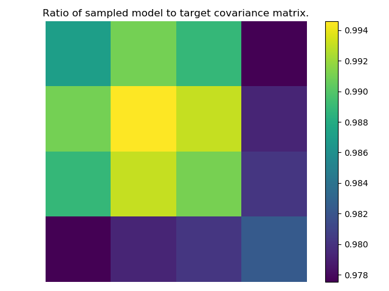

# A Non-Volume preserving transformation Implementation on the Lattice - ANVIL

Framework for training and analysing a normalising flow which is used to generate
lattice configurations.

For information on installation and usage please refer to the
[documentation](https://wilsonmr.github.io/anvil/).

### Using and Citing our code

We hope to provide a DOI for this code soon, and would really appreciate it
if you'd cite that DOI if you use this code.

`anvil` was developed by Michael Wilson, Joe Marsh Rossney and Luigi Del Debbio
to provide a framework for training and analysing normalising flows used to
generate lattice configurations

Copyright (C) 2021  Michael Wilson, Joe Marsh Rossney and Luigi Del Debbio

This program is free software: you can redistribute it and/or modify
it under the terms of the GNU General Public License as published by
the Free Software Foundation, either version 3 of the License, or
(at your option) any later version.

This program is distributed in the hope that it will be useful,
but WITHOUT ANY WARRANTY; without even the implied warranty of
MERCHANTABILITY or FITNESS FOR A PARTICULAR PURPOSE.  See the
GNU General Public License for more details.

A full copy of the license can be found in [`LICENSE`](./LICENSE).
For more information,
see [https://www.gnu.org/licenses/](https://www.gnu.org/licenses/).

## Installation

The supported installation method is via `conda`. At present a `conda` package
exists for `python=3.8`. Here is an example for creating a new `conda`
environment and installing the `anvil` package:

```bash
conda create -n anvil-dev python=3.8
conda activate anvil-dev
conda install anvil -c wilsonmr -c pytorch -c https://packages.nnpdf.science/conda
```

Once the code is installed you can import the various objects into your own
python projects. To get an idea of how to do this, look at the
`examples/train_example.py` which is discussed in
[this section](##using-objects-in-external-code.).

### Development installation

If you wish to develop the code, then replace the `anvil` package you just downloaded
via `conda` with a development installation. We still recommend installing
the `anvil` package via conda to ensure you have the correct dependencies. Then,
whilst in the root of this repository and with the relevant `conda` environment
active run:

```bash
python -m pip install -e .
```

If you plan on developing the code, then we highly recommend also installing the following packages:

 - [Jupyter](https://jupyter.org/)
 - [black](https://pypi.org/project/black/)
 - [pylint](https://pypi.org/project/pylint/)

Those packages can be installed using `conda`:

```bash
conda install jupyter black pylint
```

## Running tests

If you wish to run the tests, then the test dependencies can be found in
`conda-recipe/meta.yaml` under `test::requires`. Simply install the dependencies
via `conda`.

The tests can be run from any location, provided the code is installed, with
the command

```
pytest --pyargs anvil
```

Consider adding tests whenever modifying/adding to the code.

## phi^4 example

To train a 2d model on the phi^4 action you will need a training runcard, an
example is given in `examples/runcards/l2_train_example.yml`. To train a new
model run

```
anvil-train <runcard name>.yml
```

by default this will create an output directory in your current directory
called `<runcard name>` however a specific output can also be given

```
anvil-train <runcard name>.yml -o <custom output name>
```

each new model requires its own output directory, however existing models can
be trained further by instead by giving an exisiting fit output directory as
input as well as telling the fit which epoch to start the retrain from

```
anvil-train <existing output name> -r 1000
```

this will recommence training at epoch 1000 using a checkpoint in the
`<existing output name>`, provided it exists. Note that you can just start from
the last checkpoint in the output directory by specifying `-r -1` which uses the
standard python syntax for index the final entry in, for example, a list.

Once you are satisfied that the training is finished you can generate plots,
tables and even reports. To see which observables have been implemented run
`anvil-sample --help anvil.observables`, feel free to open PRs implementing more!
An example on how to generate a simple report is given in
`examples/runcards/training_report.yml`. To use this runcard you will need a
training output with the name `l2_train_example` in your current working directory.
To generate the report simply run

```
anvil-sample training_report.yml
```

by default the outputted resources will be saved in `output` but you can specify
a custom output using the `-o` flag.

## Using objects in external code.

In the `examples` directory there is an example of using some of the objects
defined in models to learn a multigaussian distribution, you can run it with

```bash
$ ./train_example.py
```

which should train the model, and output the plots into `./example_output/`.
If the model successfully trains, then the ratio of the covariance matrix
sampled from the trained model over the input covariance should be approximately
1 as shown in the plot below



if you have any issues using the `anvil` tools in your own projects feel free to
open an issue.
